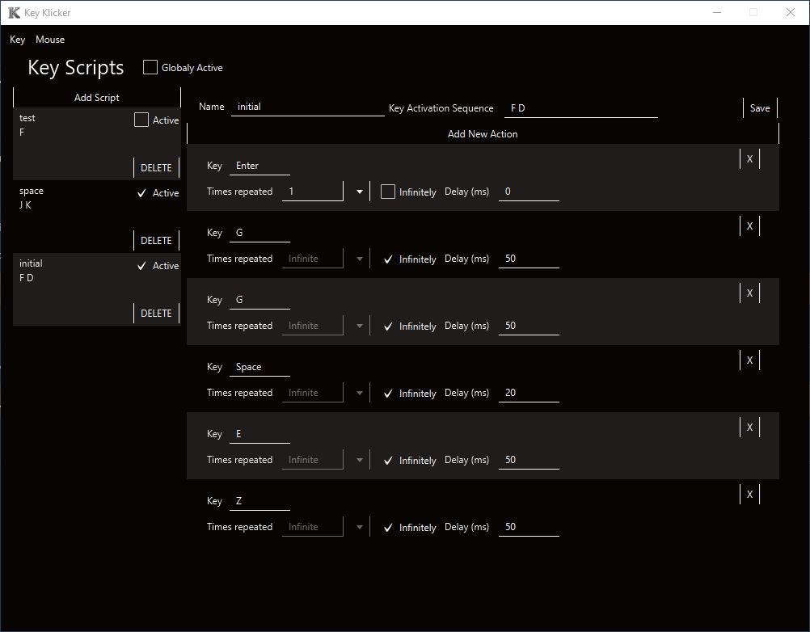
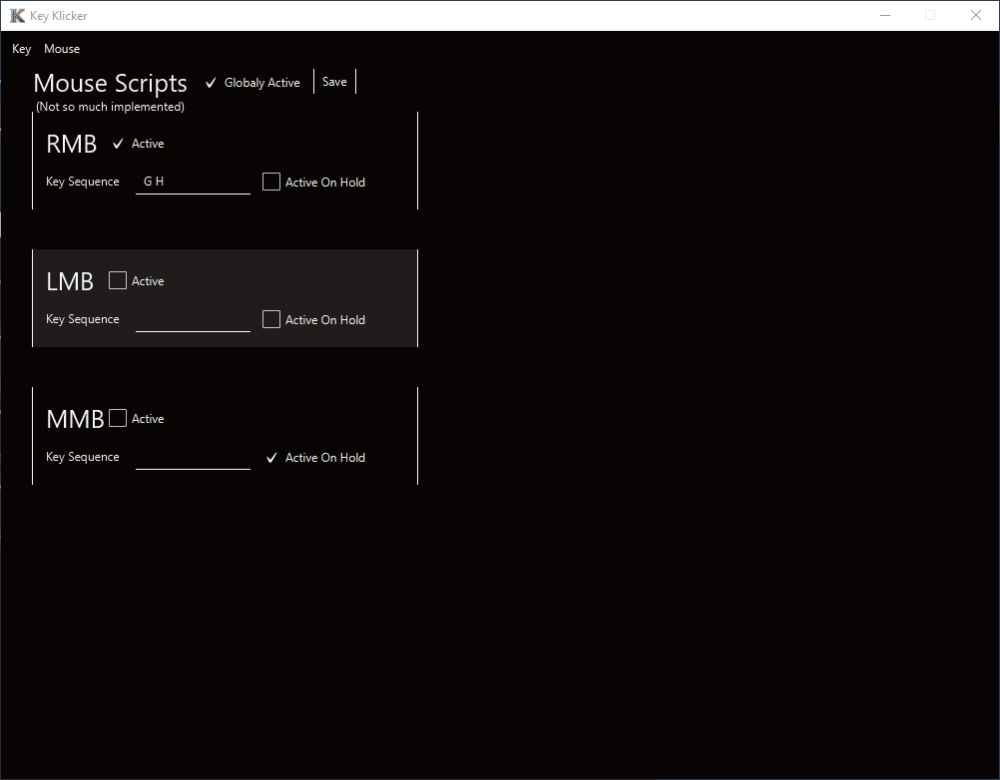
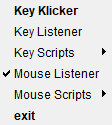
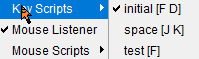

# Intro

This is my "Self Developing" project. Initial idea was to improve JavaFX skills, learn how to use foreign libs and attempt to convert it into standalone executable.

# Execution

Note: you need to have java-17 installed due to it not being provided.

## .exe

If you have JAVA_HOME variable set you should be able to launch the application by double clicking.

Also command line approach is valid

```
cd <Directory of the app>
.\Key_Klicker.exe
```

## .jar

In order to run the application using .jar file you need to refer to command line (In this case I assume you have JAVA_HOME set)

```
cd <Directory of the app>
java --module-path "./javafx-sdk-19.0.2.1/lib" --add-modules javafx.controls,javafx.fxml -jar Key_Klicker.jar
```

If you have no java installed you need to download it and place java folder into applications and then:

```
cd <Directory of the app>
./<java-folder>/bin/java.exe --module-path "./javafx-sdk-19.0.2.1/lib" --add-modules javafx.controls,javafx.fxml -jar Key_Klicker.jar
```

# Example

## Key Script



On this screennshot demonstration of "Script" is pressented.

As you may see "Globaly Active" checkbox is unchecked wich means that program is not listening for any key inputf from user. All checkboxes near "Scripts" are igniored.

NOTE: It is highly recomended to put at least some delay in orter for the recieving application to handle inputs.

So to say, script "Space" is set to active, but due to "Globaly Active" checkbox being unchecked it will not execute. And it has activation sequence as "J K".

## Mouse Script



Here we can see "Globaly Active" checkbox being checked so scripts will be executed if key combination is met.

"RMB" is "Active" with "G H" activation sequence. So if user presses this combination programm will repeatedly press right mouse button untill user enters key commbination again.

NOTE: "Active on hold" means that mouse key will be klicked and held untill key combination is pressed again.

## Tray



Here we can see that "Key Listener" is inactive and "Mouse Listener" is.

"Key Klicker" will reopen main window.

"exit" will close the programm.



So to say: script "initial" is active, rest are not.

# Explanation

Fell free to check "src/code" folder where all the Java code is presented and documented.

"src/resourses" holds all the .fxml and .css files for JavaFX.

# Conclusion

Overall as a creator I am satisfied with the result, ofcourse there are a lot of room for improvements such ass:

1. Including JavaFX folder into .exe
2. Styling tray wiew
3. minor bug fixes that i was not able to catch
4. you name it

But still it was a blast to create such tool, and experience new things.

# Reference

[JNativeHook](https://github.com/kwhat/jnativehook)

[FXTrayIcon](https://github.com/dustinkredmond/FXTrayIcon)
